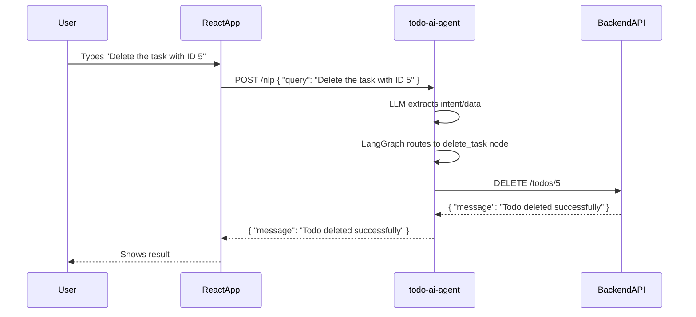

# todo-ai-agent

A natural language agent that connects your React Todo frontend to your backend API using LLMs (Ollama + Llama3), LangChain, and LangGraph.

---

## Overview

**todo-ai-agent** lets users interact with their Todo app using natural language.  
For example:  
- “Create a task to buy groceries tomorrow at 5pm.”
- “Show me all my tasks.”
- “Delete the task with ID 123.”

The agent understands your intent, figures out what you want, and calls the correct backend API endpoint for you.

---

## How It Works (Step by Step)

### 1. User Interaction

- The user types a natural language command in the React frontend (running on [http://localhost:4100](http://localhost:4100)).
- Example:  
  `Delete the task with ID 5`

### 2. Frontend Sends Request

- The React app sends a POST request to the agent’s `/nlp` endpoint:
  ```
  POST http://localhost:5001/nlp
  {
    "query": "Delete the task with ID 5"
  }
  ```

### 3. todo-ai-agent (This Project)

- Receives the request.
- Uses **Ollama** (Llama3) via **LangChain** to extract the user’s intent and relevant data from the query.
- Uses **LangGraph** to route the request to the correct action node (create, read, update, delete).
- Calls the backend API (e.g., `DELETE /todos/5`).
- Returns the backend’s response to the frontend.

### 4. Backend API

- The backend (Node/Express or Flask) performs the requested CRUD operation and returns the result.

### 5. Frontend Displays Result

- The React app shows the result to the user.

---

## UI/API Flow Diagram



---

## What is LangGraph and Why Use It?

**LangGraph** is a Python library for building and orchestrating multi-step, branching workflows with LLMs and tools.

- **In this project:**  
  LangGraph lets us define a flow where:
  - The LLM first extracts the user’s intent and data.
  - The flow then branches to the correct node (create, read, update, delete) based on that intent.
  - Each node performs the right API call and returns the result.

**Why is this helpful?**
- You can easily add new actions or logic by adding new nodes.
- The flow is clear and easy to debug.
- Beginners can see how LLMs and APIs work together in a step-by-step way.

---

## Setup Instructions

### 1. Prerequisites

- Python 3.9+
- [Ollama](https://ollama.com/) installed and running locally (`ollama run llama3`)
- Backend API running (e.g., Node/Express or Flask, on [http://localhost:4300](http://localhost:4300))

### 2. Install Dependencies

```bash
cd todo-ai-agent
python -m venv venv
source venv/bin/activate
pip install -r requirements.txt
```

### 3. Start the Agent

```bash
python app.py
```
The agent will run on [http://localhost:5001](http://localhost:5001).

### 4. Test the Agent

You can test with `curl`:
```bash
curl -X POST http://localhost:5001/nlp \
  -H "Content-Type: application/json" \
  -d '{"query": "Delete the task with ID 5"}'
```

Or from your React frontend.

---

## Example NLP Queries

- **Create:**  
  `Create a task called Buy milk with description At 5pm`
- **Read:**  
  `Show me all my tasks`
- **Update:**  
  `Update the task with ID 123 to mark it as completed`
- **Delete:**  
  `Delete the task with ID 123`

---

## Project Structure

```
todo-ai-agent/
├── app.py           # Main Flask app and LangGraph workflow
├── config.py        # Backend API URL config
├── requirements.txt # Python dependencies
└── README.md        # This file
```

---

## Troubleshooting

- Make sure Ollama is running and the Llama3 model is available.
- Ensure your backend API is running and accessible at the configured URL.
- If you see errors about missing attributes, check that you’re using the latest LangGraph and follow the code in `app.py`.

---

## Credits

- [LangGraph documentation](https://langchain-ai.github.io/langgraph/)
- [LangChain documentation](https://python.langchain.com/)
- [Ollama](https://ollama.com/)

---

**Happy hacking! 🚀**